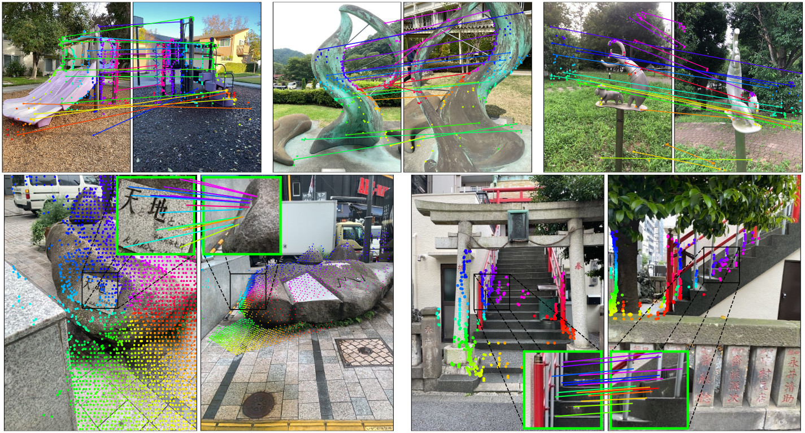
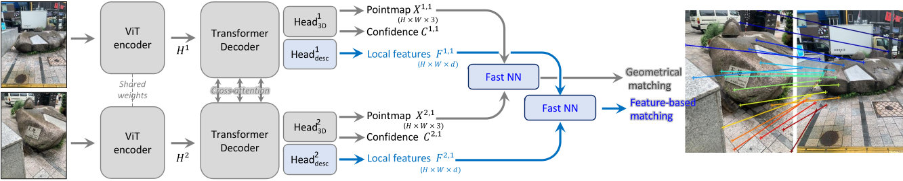
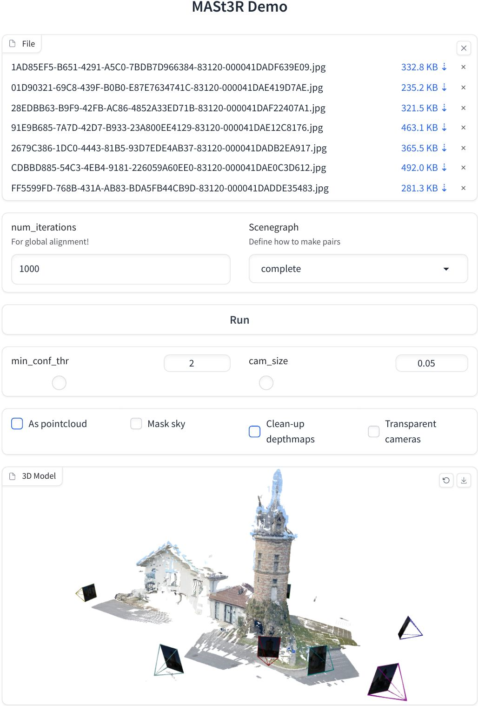
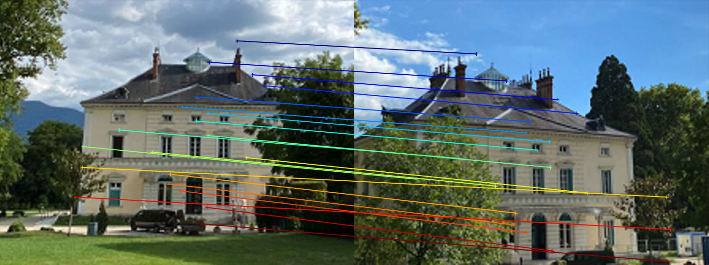

Official implementation of `Grounding Image Matching in 3D with MASt3R`  
[[Project page](https://dust3r.europe.naverlabs.com/)], [[MASt3R arxiv](https://arxiv.org/abs/2406.09756)], [[DUSt3R arxiv](https://arxiv.org/abs/2312.14132)]  





```bibtex
@misc{mast3r_arxiv24,
      title={Grounding Image Matching in 3D with MASt3R}, 
      author={Vincent Leroy and Yohann Cabon and Jerome Revaud},
      year={2024},
      eprint={2406.09756},
      archivePrefix={arXiv},
      primaryClass={cs.CV}
}

@inproceedings{dust3r_cvpr24,
      title={DUSt3R: Geometric 3D Vision Made Easy}, 
      author={Shuzhe Wang and Vincent Leroy and Yohann Cabon and Boris Chidlovskii and Jerome Revaud},
      booktitle = {CVPR},
      year = {2024}
}
```

## Table of Contents

- [Table of Contents](#table-of-contents)
- [License](#license)
- [Get Started](#get-started)
  - [Installation](#installation)
  - [Checkpoints](#checkpoints)
  - [Interactive demo](#interactive-demo)
  - [Interactive demo with docker](#interactive-demo-with-docker)
- [Usage](#usage)
- [Training](#training)
  - [Datasets](#datasets)
  - [Demo](#demo)
  - [Our Hyperparameters](#our-hyperparameters)
- [Visual Localization](#visual-localization)
  - [Dataset Preparation](#dataset-preparation)
  - [Example Commands](#example-commands)

## License

The code is distributed under the CC BY-NC-SA 4.0 License.
See [LICENSE](LICENSE) for more information.

```python
# Copyright (C) 2024-present Naver Corporation. All rights reserved.
# Licensed under CC BY-NC-SA 4.0 (non-commercial use only).
```

## Get Started

### Installation

1. Clone MASt3R.
```bash
git clone --recursive https://github.com/naver/mast3r
cd mast3r
# if you have already cloned mast3r:
# git submodule update --init --recursive
```

2. Create the environment, here we show an example using conda.
```bash
conda create -n mast3r python=3.11 cmake=3.14.0
conda activate mast3r 
conda install pytorch torchvision pytorch-cuda=12.1 -c pytorch -c nvidia  # use the correct version of cuda for your system
pip install -r requirements.txt
pip install -r dust3r/requirements.txt
# Optional: you can also install additional packages to:
# - add support for HEIC images
# - add required packages for visloc.py
pip install -r dust3r/requirements_optional.txt
```

3. Optional, compile the cuda kernels for RoPE (as in CroCo v2).
```bash
# DUST3R relies on RoPE positional embeddings for which you can compile some cuda kernels for faster runtime.
cd dust3r/croco/models/curope/
python setup.py build_ext --inplace
cd ../../../../
```


### Checkpoints

You can obtain the checkpoints by two ways:

1) You can use our huggingface_hub integration: the models will be downloaded automatically.

2) Otherwise, We provide several pre-trained models:

| Modelname   | Training resolutions | Head | Encoder | Decoder |
|-------------|----------------------|------|---------|---------|
| [`MASt3R_ViTLarge_BaseDecoder_512_catmlpdpt_metric`](https://download.europe.naverlabs.com/ComputerVision/MASt3R/MASt3R_ViTLarge_BaseDecoder_512_catmlpdpt_metric.pth) | 512x384, 512x336, 512x288, 512x256, 512x160 | CatMLP+DPT | ViT-L | ViT-B |

You can check the hyperparameters we used to train these models in the [section: Our Hyperparameters](#our-hyperparameters)
Make sure to check license of the datasets we used. 

To download a specific model, for example `MASt3R_ViTLarge_BaseDecoder_512_catmlpdpt_metric.pth`:
```bash
mkdir -p checkpoints/
wget https://download.europe.naverlabs.com/ComputerVision/MASt3R/MASt3R_ViTLarge_BaseDecoder_512_catmlpdpt_metric.pth -P checkpoints/
```

For these checkpoints, make sure to agree to the license of all the training datasets we used, in addition to CC-BY-NC-SA 4.0. 
The mapfree dataset license in particular is very restrictive. For more information, check [CHECKPOINTS_NOTICE](CHECKPOINTS_NOTICE).


### Interactive demo

We made one huggingface space running the new sparse global alignment in a simplified demo for small scenes: [naver/MASt3R](https://huggingface.co/spaces/naver/MASt3R)
There are two demos available to run locally:

```
demo.py is the updated demo for MASt3R. It uses our new sparse global alignment method that allows you to reconstruct larger scenes

python3 demo.py --model_name MASt3R_ViTLarge_BaseDecoder_512_catmlpdpt_metric

# Use --weights to load a checkpoint from a local file, eg --weights checkpoints/MASt3R_ViTLarge_BaseDecoder_512_catmlpdpt_metric.pth
# Use --local_network to make it accessible on the local network, or --server_name to specify the url manually
# Use --server_port to change the port, by default it will search for an available port starting at 7860
# Use --device to use a different device, by default it's "cuda"

demo_dust3r_ga.py is the same demo as in dust3r (+ compatibility for MASt3R models)
see https://github.com/naver/dust3r?tab=readme-ov-file#interactive-demo for details
```

### Interactive demo with docker

To run MASt3R using Docker, including with NVIDIA CUDA support, follow these instructions:

1. **Install Docker**: If not already installed, download and install `docker` and `docker compose` from the [Docker website](https://www.docker.com/get-started).

2. **Install NVIDIA Docker Toolkit**: For GPU support, install the NVIDIA Docker toolkit from the [Nvidia website](https://docs.nvidia.com/datacenter/cloud-native/container-toolkit/latest/install-guide.html).

3. **Build the Docker image and run it**: `cd` into the `./docker` directory and run the following commands: 

```bash
cd docker
bash run.sh --with-cuda --model_name="MASt3R_ViTLarge_BaseDecoder_512_catmlpdpt_metric"
```

Or if you want to run the demo without CUDA support, run the following command:

```bash 
cd docker
bash run.sh --model_name="MASt3R_ViTLarge_BaseDecoder_512_catmlpdpt_metric"
```

By default, `demo.py` is lanched with the option `--local_network`.  
Visit `http://localhost:7860/` to access the web UI (or replace `localhost` with the machine's name to access it from the network).  

`run.sh` will launch docker-compose using either the [docker-compose-cuda.yml](docker/docker-compose-cuda.yml) or [docker-compose-cpu.ym](docker/docker-compose-cpu.yml) config file, then it starts the demo using [entrypoint.sh](docker/files/entrypoint.sh).

___



## Usage

```python
from mast3r.model import AsymmetricMASt3R
from mast3r.fast_nn import fast_reciprocal_NNs

import mast3r.utils.path_to_dust3r
from dust3r.inference import inference
from dust3r.utils.image import load_images

if __name__ == '__main__':
    device = 'cuda'
    schedule = 'cosine'
    lr = 0.01
    niter = 300

    model_name = "naver/MASt3R_ViTLarge_BaseDecoder_512_catmlpdpt_metric"
    # you can put the path to a local checkpoint in model_name if needed
    model = AsymmetricMASt3R.from_pretrained(model_name).to(device)
    images = load_images(['dust3r/croco/assets/Chateau1.png', 'dust3r/croco/assets/Chateau2.png'], size=512)
    output = inference([tuple(images)], model, device, batch_size=1, verbose=False)

    # at this stage, you have the raw dust3r predictions
    view1, pred1 = output['view1'], output['pred1']
    view2, pred2 = output['view2'], output['pred2']

    desc1, desc2 = pred1['desc'].squeeze(0).detach(), pred2['desc'].squeeze(0).detach()

    # find 2D-2D matches between the two images
    matches_im0, matches_im1 = fast_reciprocal_NNs(desc1, desc2, subsample_or_initxy1=8,
                                                   device=device, dist='dot', block_size=2**13)

    # ignore small border around the edge
    H0, W0 = view1['true_shape'][0]
    valid_matches_im0 = (matches_im0[:, 0] >= 3) & (matches_im0[:, 0] < int(W0) - 3) & (
        matches_im0[:, 1] >= 3) & (matches_im0[:, 1] < int(H0) - 3)

    H1, W1 = view2['true_shape'][0]
    valid_matches_im1 = (matches_im1[:, 0] >= 3) & (matches_im1[:, 0] < int(W1) - 3) & (
        matches_im1[:, 1] >= 3) & (matches_im1[:, 1] < int(H1) - 3)

    valid_matches = valid_matches_im0 & valid_matches_im1
    matches_im0, matches_im1 = matches_im0[valid_matches], matches_im1[valid_matches]

    # visualize a few matches
    import numpy as np
    import torch
    import torchvision.transforms.functional
    from matplotlib import pyplot as pl

    n_viz = 20
    num_matches = matches_im0.shape[0]
    match_idx_to_viz = np.round(np.linspace(0, num_matches - 1, n_viz)).astype(int)
    viz_matches_im0, viz_matches_im1 = matches_im0[match_idx_to_viz], matches_im1[match_idx_to_viz]

    image_mean = torch.as_tensor([0.5, 0.5, 0.5], device='cpu').reshape(1, 3, 1, 1)
    image_std = torch.as_tensor([0.5, 0.5, 0.5], device='cpu').reshape(1, 3, 1, 1)

    viz_imgs = []
    for i, view in enumerate([view1, view2]):
        rgb_tensor = view['img'] * image_std + image_mean
        viz_imgs.append(rgb_tensor.squeeze(0).permute(1, 2, 0).cpu().numpy())

    H0, W0, H1, W1 = *viz_imgs[0].shape[:2], *viz_imgs[1].shape[:2]
    img0 = np.pad(viz_imgs[0], ((0, max(H1 - H0, 0)), (0, 0), (0, 0)), 'constant', constant_values=0)
    img1 = np.pad(viz_imgs[1], ((0, max(H0 - H1, 0)), (0, 0), (0, 0)), 'constant', constant_values=0)
    img = np.concatenate((img0, img1), axis=1)
    pl.figure()
    pl.imshow(img)
    cmap = pl.get_cmap('jet')
    for i in range(n_viz):
        (x0, y0), (x1, y1) = viz_matches_im0[i].T, viz_matches_im1[i].T
        pl.plot([x0, x1 + W0], [y0, y1], '-+', color=cmap(i / (n_viz - 1)), scalex=False, scaley=False)
    pl.show(block=True)
```


## Training

In this section, we present a short demonstration to get started with training MASt3R.

### Datasets

See [Datasets section in DUSt3R](https://github.com/naver/dust3r?tab=readme-ov-file#datasets)

### Demo

Like for the DUSt3R training demo, we're going to download and prepare the same subset of [CO3Dv2](https://github.com/facebookresearch/co3d) - [Creative Commons Attribution-NonCommercial 4.0 International](https://github.com/facebookresearch/co3d/blob/main/LICENSE) and launch the training code on it.
It is the exact same process as DUSt3R.
The demo model will be trained for a few epochs on a very small dataset.
It will not be very good.

```bash
# download and prepare the co3d subset
mkdir -p data/co3d_subset
cd data/co3d_subset
git clone https://github.com/facebookresearch/co3d
cd co3d
python3 ./co3d/download_dataset.py --download_folder ../ --single_sequence_subset
rm ../*.zip
cd ../../..

python3 datasets_preprocess/preprocess_co3d.py --co3d_dir data/co3d_subset --output_dir data/co3d_subset_processed  --single_sequence_subset

# download the pretrained dust3r checkpoint
mkdir -p checkpoints/
wget https://download.europe.naverlabs.com/ComputerVision/DUSt3R/DUSt3R_ViTLarge_BaseDecoder_512_dpt.pth -P checkpoints/

# for this example we'll do fewer epochs, for the actual hyperparameters we used in the paper, see the next section: "Our Hyperparameters"
torchrun --nproc_per_node=4 train.py \
    --train_dataset "1000 @ Co3d(split='train', ROOT='data/co3d_subset_processed', aug_crop='auto', aug_monocular=0.005, aug_rot90='diff', mask_bg='rand', resolution=[(512, 384), (512, 336), (512, 288), (512, 256), (512, 160)], n_corres=8192, nneg=0.5, transform=ColorJitter)" \
    --test_dataset "100 @ Co3d(split='test', ROOT='data/co3d_subset_processed', resolution=(512,384), n_corres=1024, seed=777)" \
    --model "AsymmetricMASt3R(pos_embed='RoPE100', patch_embed_cls='ManyAR_PatchEmbed', img_size=(512, 512), head_type='catmlp+dpt', output_mode='pts3d+desc24', depth_mode=('exp', -inf, inf), conf_mode=('exp', 1, inf), enc_embed_dim=1024, enc_depth=24, enc_num_heads=16, dec_embed_dim=768, dec_depth=12, dec_num_heads=12, two_confs=True)" \
    --train_criterion "ConfLoss(Regr3D(L21, norm_mode='?avg_dis'), alpha=0.2) + 0.075*ConfMatchingLoss(MatchingLoss(InfoNCE(mode='proper', temperature=0.05), negatives_padding=0, blocksize=8192), alpha=10.0, confmode='mean')" \
    --test_criterion "Regr3D_ScaleShiftInv(L21, norm_mode='?avg_dis', gt_scale=True, sky_loss_value=0) + -1.*MatchingLoss(APLoss(nq='torch', fp=torch.float16), negatives_padding=12288)" \
    --pretrained "checkpoints/DUSt3R_ViTLarge_BaseDecoder_512_dpt.pth" \
    --lr 0.0001 --min_lr 1e-06 --warmup_epochs 1 --epochs 10 --batch_size 4 --accum_iter 4 \
    --save_freq 1 --keep_freq 5 --eval_freq 1 --disable_cudnn_benchmark \
    --output_dir "checkpoints/mast3r_demo"

```

### Our Hyperparameters
We didn't release all the training datasets, but here are the commands we used for training our models:

```bash
# MASt3R_ViTLarge_BaseDecoder_512_catmlpdpt_metric - train mast3r with metric regression and matching loss
# we used cosxl to generate variations of DL3DV: "foggy", "night", "rainy", "snow", "sunny" but we were not convinced by it.

torchrun --nproc_per_node=8 train.py \
    --train_dataset "57_000 @ Habitat512(1_000_000, split='train', resolution=[(512, 384), (512, 336), (512, 288), (512, 256), (512, 160)], aug_crop='auto', aug_monocular=0.005, transform=ColorJitter, n_corres=8192, nneg=0.5) + 68_400 @ BlendedMVS(split='train', mask_sky=True, resolution=[(512, 384), (512, 336), (512, 288), (512, 256), (512, 160)], aug_crop='auto', aug_monocular=0.005, transform=ColorJitter, n_corres=8192, nneg=0.5) + 68_400 @ MegaDepth(split='train', mask_sky=True, resolution=[(512, 384), (512, 336), (512, 288), (512, 256), (512, 160)], aug_crop='auto', aug_monocular=0.005, transform=ColorJitter, n_corres=8192, nneg=0.5) + 45_600 @ ARKitScenes(split='train', resolution=[(512, 384), (512, 336), (512, 288), (512, 256), (512, 160)], aug_crop='auto', aug_monocular=0.005, transform=ColorJitter, n_corres=8192, nneg=0.5) + 22_800 @ Co3d(split='train', mask_bg='rand', resolution=[(512, 384), (512, 336), (512, 288), (512, 256), (512, 160)], aug_crop='auto', aug_monocular=0.005, transform=ColorJitter, n_corres=8192, nneg=0.5) + 22_800 @ StaticThings3D(mask_bg='rand', resolution=[(512, 384), (512, 336), (512, 288), (512, 256), (512, 160)], aug_crop='auto', aug_monocular=0.005, transform=ColorJitter, n_corres=8192, nneg=0.5) + 45_600 @ ScanNetpp(split='train', resolution=[(512, 384), (512, 336), (512, 288), (512, 256), (512, 160)], aug_crop='auto', aug_monocular=0.005, transform=ColorJitter, n_corres=8192, nneg=0.5) + 45_600 @ TartanAir(pairs_subset='', resolution=[(512, 384), (512, 336), (512, 288), (512, 256), (512, 160)], aug_crop='auto', aug_monocular=0.005, transform=ColorJitter, n_corres=8192, nneg=0.5) + 4_560 @ UnrealStereo4K(resolution=[(512, 384), (512, 336), (512, 288), (512, 256), (512, 160)], aug_crop='auto', aug_monocular=0.005, transform=ColorJitter, n_corres=8192, nneg=0.5) + 1_140 @ VirtualKitti(optical_center_is_centered=True, resolution=[(512, 384), (512, 336), (512, 288), (512, 256), (512, 160)], aug_crop='auto', aug_monocular=0.005, transform=ColorJitter, n_corres=8192, nneg=0.5) + 22_800 @ WildRgbd(split='train', mask_bg='rand', resolution=[(512, 384), (512, 336), (512, 288), (512, 256), (512, 160)], aug_crop='auto', aug_monocular=0.005, transform=ColorJitter, n_corres=8192, nneg=0.5) + 145_920 @ NianticMapFree(split='train', resolution=[(512, 384), (512, 336), (512, 288), (512, 256), (512, 160)], aug_crop='auto', aug_monocular=0.005, transform=ColorJitter, n_corres=8192, nneg=0.5) + 57_000 @ DL3DV(split='nlight', resolution=[(512, 384), (512, 336), (512, 288), (512, 256), (512, 160)], aug_crop='auto', aug_monocular=0.005, transform=ColorJitter, n_corres=8192, nneg=0.5) + 57_000 @ DL3DV(split='not-nlight', cosxl_augmentations=None, resolution=[(512, 384), (512, 336), (512, 288), (512, 256), (512, 160)], aug_crop='auto', aug_monocular=0.005, transform=ColorJitter, n_corres=8192, nneg=0.5) + 34_200 @ InternalUnreleasedDataset(resolution=[(512, 384), (512, 336), (512, 288), (512, 256), (512, 160)], aug_crop='auto', aug_monocular=0.005, transform=ColorJitter, n_corres=8192, nneg=0.5)" \
    --test_dataset "Habitat512(1_000, split='val', resolution=(512,384), seed=777, n_corres=1024) + 1_000 @ BlendedMVS(split='val', resolution=(512,384), mask_sky=True, seed=777, n_corres=1024) + 1_000 @ ARKitScenes(split='test', resolution=(512,384), seed=777, n_corres=1024) + 1_000 @ MegaDepth(split='val', mask_sky=True, resolution=(512,336), seed=777, n_corres=1024) + 1_000 @ Co3d(split='test', resolution=(512,384), mask_bg='rand', seed=777, n_corres=1024)" \
    --model "AsymmetricMASt3R(pos_embed='RoPE100', patch_embed_cls='ManyAR_PatchEmbed', img_size=(512, 512), head_type='catmlp+dpt', output_mode='pts3d+desc24', depth_mode=('exp', -inf, inf), conf_mode=('exp', 1, inf), enc_embed_dim=1024, enc_depth=24, enc_num_heads=16, dec_embed_dim=768, dec_depth=12, dec_num_heads=12, two_confs=True, desc_conf_mode=('exp', 0, inf))" \
    --train_criterion "ConfLoss(Regr3D(L21, norm_mode='?avg_dis'), alpha=0.2, loss_in_log=False) + 0.075*ConfMatchingLoss(MatchingLoss(InfoNCE(mode='proper', temperature=0.05), negatives_padding=0, blocksize=8192), alpha=10.0, confmode='mean')" \
    --test_criterion "Regr3D(L21, norm_mode='?avg_dis', gt_scale=True, sky_loss_value=0) + -1.*MatchingLoss(APLoss(nq='torch', fp=torch.float16), negatives_padding=12288)" \
    --pretrained "checkpoints/DUSt3R_ViTLarge_BaseDecoder_512_dpt.pth" \
    --lr 0.0001 --min_lr 1e-06 --warmup_epochs 8 --epochs 50 --batch_size 4 --accum_iter 2 \
    --save_freq 1 --keep_freq 5 --eval_freq 1 --print_freq=10 --disable_cudnn_benchmark \
    --output_dir "checkpoints/MASt3R_ViTLarge_BaseDecoder_512_catmlpdpt_metric"

```

## Visual Localization

### Dataset preparation

See [Visloc section in DUSt3R](https://github.com/naver/dust3r/blob/main/dust3r_visloc/README.md#dataset-preparation)

### Example Commands

With `visloc.py` you can run our visual localization experiments on Aachen-Day-Night, InLoc, Cambridge Landmarks and 7 Scenes.


```bash
# Aachen-Day-Night-v1.1:
# scene in 'day' 'night'
# scene can also be 'all'
python3 visloc.py --model_name MASt3R_ViTLarge_BaseDecoder_512_catmlpdpt_metric --dataset "VislocAachenDayNight('/path/to/prepared/Aachen-Day-Night-v1.1/', subscene='${scene}', pairsfile='fire_top50', topk=20)" --pixel_tol 5 --pnp_mode poselib --reprojection_error_diag_ratio 0.008 --output_dir /path/to/output/Aachen-Day-Night-v1.1/${scene}/loc

# or with coarse to fine:

python3 visloc.py --model_name MASt3R_ViTLarge_BaseDecoder_512_catmlpdpt_metric --dataset "VislocAachenDayNight('/path/to/prepared/Aachen-Day-Night-v1.1/', subscene='${scene}', pairsfile='fire_top50', topk=20)" --pixel_tol 5 --pnp_mode poselib --reprojection_error_diag_ratio 0.008 --output_dir /path/to/output/Aachen-Day-Night-v1.1/${scene}/loc --coarse_to_fine --max_batch_size 48 --c2f_crop_with_homography

# InLoc
python3 visloc.py --model_name MASt3R_ViTLarge_BaseDecoder_512_catmlpdpt_metric --dataset "VislocInLoc('/path/to/prepared/InLoc/', pairsfile='pairs-query-netvlad40-temporal', topk=20)" --pixel_tol 5 --pnp_mode poselib --reprojection_error_diag_ratio 0.008 --output_dir /path/to/output/InLoc/loc

# or with coarse to fine:

python3 visloc.py --model_name MASt3R_ViTLarge_BaseDecoder_512_catmlpdpt_metric --dataset "VislocInLoc('/path/to/prepared/InLoc/', pairsfile='pairs-query-netvlad40-temporal', topk=20)" --pixel_tol 5 --pnp_mode poselib --reprojection_error_diag_ratio 0.008 --output_dir /path/to/output/InLoc/loc --coarse_to_fine --max_image_size 1200 --max_batch_size 48 --c2f_crop_with_homography

# 7-scenes:
# scene in 'chess' 'fire' 'heads' 'office' 'pumpkin' 'redkitchen' 'stairs'
python3 visloc.py --model_name MASt3R_ViTLarge_BaseDecoder_512_catmlpdpt_metric --dataset "VislocSevenScenes('/path/to/prepared/7-scenes/', subscene='${scene}', pairsfile='APGeM-LM18_top20', topk=1)" --pixel_tol 5 --pnp_mode poselib --reprojection_error_diag_ratio 0.008 --output_dir /path/to/output/7-scenes/${scene}/loc

# Cambridge Landmarks:
# scene in 'ShopFacade' 'GreatCourt' 'KingsCollege' 'OldHospital' 'StMarysChurch'
python3 visloc.py --model_name MASt3R_ViTLarge_BaseDecoder_512_catmlpdpt_metric --dataset "VislocCambridgeLandmarks('/path/to/prepared/Cambridge_Landmarks/', subscene='${scene}', pairsfile='APGeM-LM18_top50', topk=20)" --pixel_tol 5 --pnp_mode poselib --reprojection_error_diag_ratio 0.008 --output_dir /path/to/output/Cambridge_Landmarks/${scene}/loc

```
